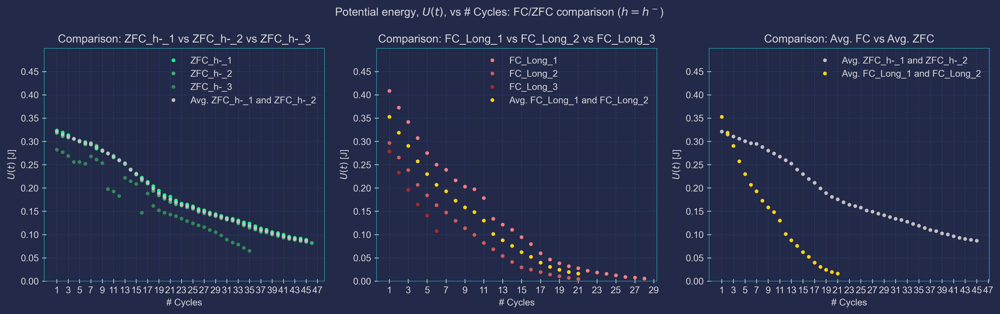

# Superconductor Cooling Study for Magnetically Levitating Cars (Field Cooling vs. Zero Field Cooling)

Welcome to the Superconductor Cooling Study repository! Here, we investigate the impact of cooling methods on the performance of superconductors in magnetically levitating cars. Specifically, we compare Field Cooling (FC) with Zero Field Cooling (ZFC) to understand their effects on levitation stability, energy efficiency, and overall performance.

## Background

Superconductors exhibit remarkable properties, including zero electrical resistance and the expulsion of magnetic fields when cooled below a critical temperature. These properties make them ideal for various applications, including magnetic levitation (maglev) transportation systems. Usually, in a maglev system, superconducting magnets generate magnetic fields that repel against each other and the track, allowing for frictionless movement and high-speed transportation. In our case, though, we utilize high-temperature-superconductors (HTS), built into the car, which repel the track's magnetic field, produced by permanent magnets. This is what makes the car levitate, allowing for frictionless movement, neglecting air resistance, of course.  Hence, our interest in studying how the cooling process affects the maglev system's performance, overall.

As is widely known in the physics of superconductors, the cooling process plays a crucial role in determining the superconductor's characteristics. Two common cooling methods are Field Cooling (FC) and Zero Field Cooling (ZFC). FC involves cooling the superconductor in the presence of an applied magnetic field (which favour flux pinning, which, generally, provides greater stability to the car), while ZFC involves cooling the superconductor without an applied field (this results in, overall, fewer Joule losses; these come at the cost of less stability).

## Objective

The primary objective of this study is to compare the effects of FC and ZFC on the performance metrics of magnetically levitating cars. By analyzing factors such as levitation stability, power consumption, and temperature distribution, we aim to identify the optimal cooling method for maximizing efficiency and performance.

## Preliminary Results

*Figure 1: Preliminary results comparing the performance of superconductors under FC and ZFC conditions, for some initial height, h^{-}.*

## How to Use

To replicate our experiments or contribute to the study, simply clone this repository and follow the instructions provided in the documentation.

## Contributing

We welcome contributions from the community to further enhance our understanding of superconductor cooling techniques and their applications in magnetically levitating transportation systems. Please reach out to me ([Afonso Azenha](mailto:afonso.azenha@tecnico.ulisboa.pt)) in case you're interested in contributing in any way, shape or form!

## License

This project is licensed under the [MIT License](LICENSE).

---

*For any questions or inquiries, please contact [Afonso Azenha](mailto:afonso.azenha@tecnico.ulisboa.pt).*
